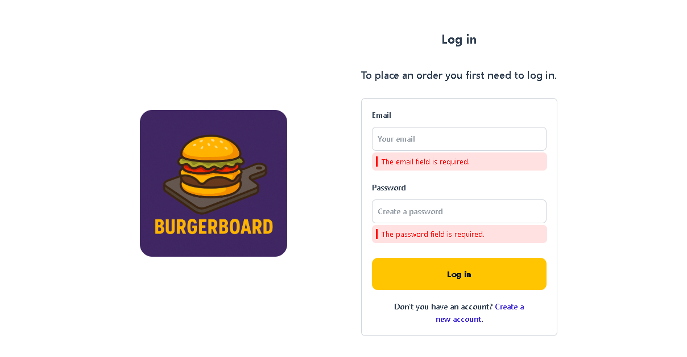
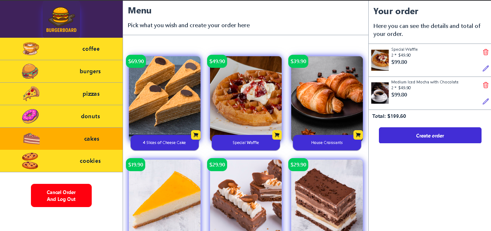
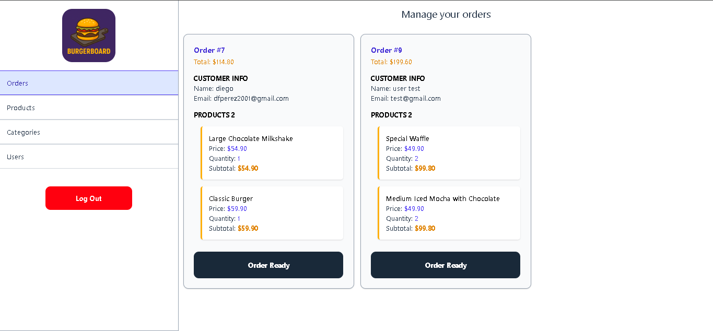
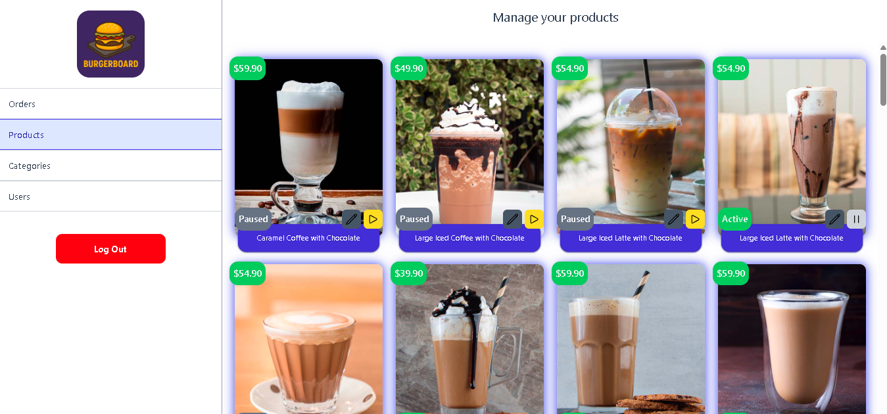

# 🍔 BurgerBoard

**BurgerBoard** is a fullstack application built with **React** and **Laravel Sanctum**.
It serves as a restaurant kiosk system where users can create personal accounts, log in, and place food orders.

---

## 🚀 Features

- User registration and authentication with Laravel Sanctum
- Personal user accounts to place and manage orders
- Admin panel to manage product availability and order status
- Role-based access control
- Real-time feedback using toasts
- Reponse validation with Valibot

---

## 🛠️ Tech Stack

### Backend

- Laravel 12
- Sanctum for API authentication

➡️ [API Repository](https://github.com/Diego3128/burgerboard.git)

### Frontend

- React 19
- Tailwind CSS 4
- Zustand for state management
- React Router DOM 7
- SWR for data fetching and caching
- Axios for HTTP requests
- React Toastify for notifications
- Valibot for reponse validation

---

## 🗋 Project Structure

```bash
src/
|-- components/
|-- config/
|-- data/
|-- helpers/
|-- hooks/
|-- layouts/
|-- schemas/
|-- services/
|-- stores/
|-- types/
|-- views/
|-- index.css
|-- main.tsx
|-- Router.tsx
```

---

## 📸 Screenshots

### Login



### Create Order



### Admin Panel - Orders



### Admin Panel - Products



---

## 🙌 Getting Started

1. Clone the repository
2. Set up the Laravel backend with Sanctum authentication
3. Install frontend dependencies

```bash
npm install
npm run dev
```

Make sure to configure environment variables for both frontend and backend.

---

## 🛌 License

This project is licensed under the MIT License.
